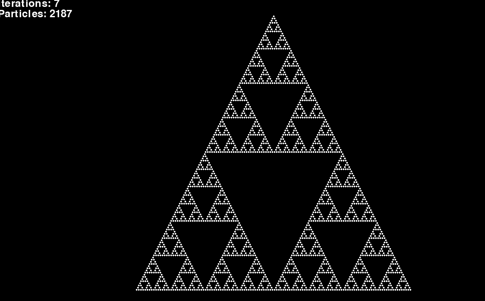

# Particles

The project is named Particles but i've just implemented just [Sierpiński triangle](https://en.wikipedia.org/wiki/Sierpi%C5%84ski_triangle)...
Idk maybe i will add more particle things here?


## Sierpiński triangle



### How to run
// Install pygame if you don't have it.
```
$ pip install pygame
$ python sierpinski_triangle.py
```

# References
- Rendered using [pygame](https://pygame.org)
- [Sierpiński triangle](https://en.wikipedia.org/wiki/Sierpi%C5%84ski_triangle)
